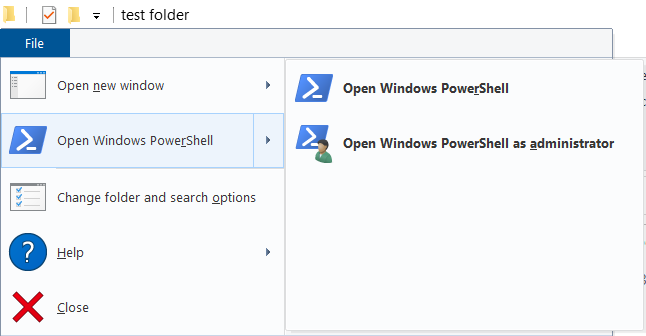

# Python from Scratch - How to Write a Computer Program.
An introduction to Python and perhaps to programming in general.

This is a lesson on how to write a computer program. We are going to be doing this using the very popular programming language Python, which according to [one of the industry's biggest surveys](https://survey.stackoverflow.co/2022/#section-most-popular-technologies-programming-scripting-and-markup-languages) was the fourth most widely used programming language in the world in 2022 and the most popular language that isn't specialized for databases or webpages. It's also very similar to a lot of other programming languages so you can easily go back and forth between them and it. It's worth knowing, is what I'm saying. It's an industry standard kind of thing. Everyone knows Python. It was named after the British comedy group Monty Python who made movies like the one about the Holy Grail. So we're going to use it to achieve our ultimate goal, which is to write a computer program. We are going to journey through procedural programming, into functional programming, and finally hit up object-oriented programming in order to learn the whole CS1A and B curriculum, in like, ten minutes to an hour, I'm not sure how long this'll take yet. As we go, we're going to see the most basic and important data structures that programmers use as well as learning how logic and input work in a computer program. If this still sounds basic, sorry, but this is only like week two of the semester. Play along, or heckle, or something. For anyone new to this stuff: welcome to programming. So. Does everyone have Python installed?

It is available at https://www.python.org/downloads/. I am using the latest version, Python 3.11, but any version that starts with "3" should be fine.

I don't want to dwell on getting everyone to set up fancy coding and editing software, so I'm going ask everyone to create a super basic setup for this. Make a new folder on your computer, called something like "fun_programs". Open up a plain text editor such as Notepad or TextEdit and save a new file in that folder called `inventory.py`. Then, open a terminal window in that folder.

Windows has two terminal applications: an old one called CMD and a new one called PowerShell. You might as well get with the times and use PowerShell. To open it, just hold shift and right click in the blank space in a folder and click the "Open PowerShell window here" option in the menu that appears. Or, use the menu in the top left corner of File Explorer:



Mac OS X has one terminal application. It is called "Terminal." You are going to need to open it and then switch what folder is open in it. To do that, open the Terminal, type the letters "cd" and then a space, and then drag the folder you're working with from the Finder into the terminal window. Then hit enter. "cd" stands for Change Directory; "directory" is a synonym for "folder"; and so this will make your Terminal change over to the folder you drug into it, whose path should have appeared there.

If you're on Linux, I'm assuming you know what you're doing. Good luck, or ask someone else here and see what happens.

A terminal, also called a command prompt or a shell, is a program that lets you enter text-based commands into a text area called the command line that execute programs; if you're used to opening programs on OS X or Windows, this is just like, typing the program's name to run it instead of double-clicking on it. The advantage over the double-clicking thing is that you can enter detailed commands after a program's name that specify what you want it to do very straightforwardly, without like menus and stuff. Programmers love command line interfaces, in part because it's easier to automate textual commands than it is to automate mouse movements and clicks, and also because it's just a simpler way to run programs to some people's minds. We're going to use this to run our Python program, but also, pretty much any program that you write can be executed using the command line and it's often the simplest way. You can compile and run C++ programs that you write in university CS classes using these same basic tools. We're going to write a program here in the text editor that you opened; it will look like this:

```python
print("Hello, World!")
```

Write that, and then save it. Then, run it in the command line by typing `python inventory.py`. (If you're on a Linux operating system that previously used old versions of Python, you might have to specify the version you want by using `python3 inventory.py` instead.)

Did that work? If it did: great! The boring part is over. Now we can start programming. The hardest part of running Python programs is always the setup, even in this case where it's a really simple one.

You may have noticed that we have written a computer program now. The computer program outputs the words "Hello, World" into the command line in which it was run. The word "print" in computer programming actually means "output this text to the command line," because we have changed the output device of our programs from printers to screens but kept the name for creating the output the same. The punctuation requirements here are pretty specific: you have to have the word "print", an open parenthesis, a quotation mark, some text, a closing quotation mark, and a closing parenthesis. All of this punctuation is part of a system: I promise. And now we can start to pull it apart and understand how it works.

We've technically written a computer program, but it's not a very impressive one. I don't want to write a program to output some text to the command line; I want to write a program to keep track of my collection of gamer mice. To do that, I'm going to create my first variable. You're probably vaguely familiar with the concept of variables from algebra. In programming, we use them as follows: we pick a variable name, like "mouse", and we store some data under it.

```python
mouse = "Logitech G502 HERO SE"
```

The data we are storing here is called a string. A string is the computer word for "some text." You can create a string by putting some text in quotation marks. The quotation marks mean, "this text is here purely to be used as data; it does not contain commands or instructions or stuff the program needs to do." We are assigning this data to a variable called "mouse" by putting the variable name, then an equals sign, then the data. You probably get the idea. Now, I want to change the print statement. Instead of printing out Hello, World, I want to print the name of my mouse. I can do that without retyping that whole long thing, like this:

```python
print(mouse)
```

Run this program on the command line by typing `python inventory.py` (or maybe `python3 inventory.py`.) As you can see, whereas before, we were printing a string, now we are printing a variable, and we are getting the string that was stored under or in that variable. In general, variable names give you a way to refer to data without writing all the data out. Change it and try this again:

```python
mouse = "Chuck E. Cheese"
print(mouse)
```

This works too. Because: what is Chuck E. Cheese, if not a gamer mouse?

### initial outline:

we're writing a program to keep track of all the books, that are on a shelf. this is how you store a book's title in a variable; we could make more variables, like book1, book2, etc, but actually we can just make a list. for loops let us iterate over every book in the list and print their name out. while loops let us accept book names from user input until they say "stop." if statements can be used to only store a book's name if it meets certain criteria, like having a minimum length. we can store numbers in variables and update them over time to keep track of how many books there are. we can also divide this code into functions called like count_books_with_this_title and print_books_out and call them as many times and in whatever order that we would like.

dicts can be used to map book names to book authors, so you can look up who wrote a certain book. you can also make a dict that stores a bunch of keys and a bunch of values for a book, so you can keep track of what year it was published and how many pages it has and stuff like that. then, you can make a whole list of dicts, to store this stuff for all of your books. do you wish you could put functions in your dict? make a class that has member functions and convert your list of dicts into a list of objects. there, now you can finally store your books on your bookshelf in an optimal form. if you want to save this data somewhere persistent, come to our database lesson. if you want to do a whole bunch of other stuff, come to all our other lessons too. if you couldn't get python working, i am so so sorry.

notes from katie:
 - we'd have to make sure that after it's written it's not super complicated, since we don't have like beginner and advanced lessons anymore, but that would be fun :D
 - you could even expand the "libaray" idea and make it like, a library of.....i dunno something fun, and then it'd have the "cute" or "fun" aspect to it too
